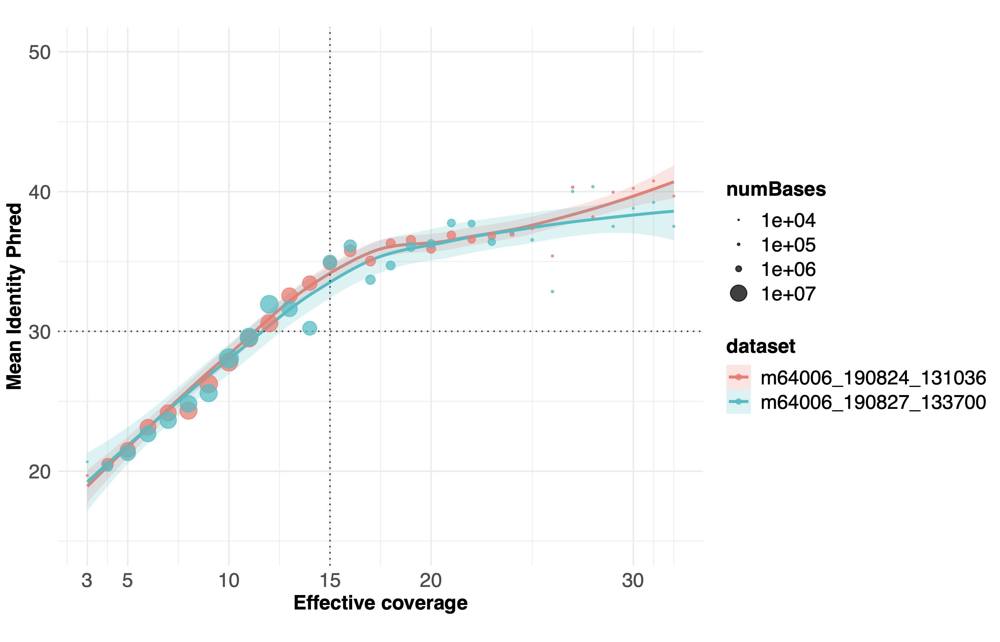

<h1 align="center"></h1>
<h1 align="center">harmony</h1>

Compute error profiles from alignments.

# Dependencies
- CCS
  - `conda install -c bioconda pbccs`
- Alignment
  - `conda install -c bioconda pbmm2`
- Harmony
  - Get binary from [releases](https://github.com/pacificbiosciences/harmony/releases/tag/v0.1.0)
  - DYI: `boost`, `meson`, `ninja`, C++14 compiler, Linux or MacOS environment
- Create plot
  - R with `vroom`, `dplyr`, `ggplot2`

# How to compile (for dyi)

    mkdir build && cd build
    meson --prefix ~/mytools
    ninja
    ninja install

# How to use
## Generate HiFi data

    ccs m64006_190824_131036.subreads.bam m64006_190824_131036.hifi.bam --log-level INFO

## Align HiFi data

    pbmm2 align --best-n 1 --preset HiFi \
                ref.fasta m64006_190824_131036.hifi.bam m64006_190824_131036.hifi.aligned.bam

## Extract error profiles

    ~/mytools/bin/harmony m64006_190824_131036.hifi.aligned.bam ref.fasta > m64006_190824_131036

## Plot curve

Provide one or more input files

    scripts/single.R m64006_190824_131036 m64006_190827_133700

This generates a `harmony.pdf` similar to this example

